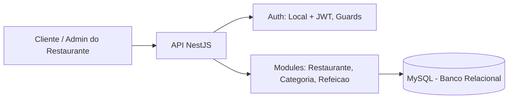
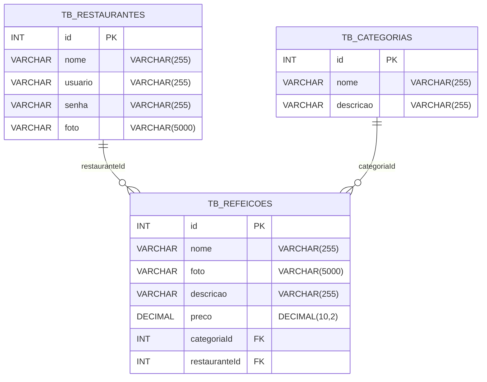

# NutriHub — Plataforma Digital de Delivery para Restaurantes (White Label)

O **NutriHub** é uma plataforma digital de delivery **white label** desenvolvida como Projeto Integrador na **Generation Brasil (Turma JavaScript 12)** — **Grupo 04**.

A solução permite que **cada restaurante** tenha seu próprio ambiente para **gerenciar cardápio**, **categorias**, **preços** e **imagens**, com **autenticação** e gestão independente (modelo SaaS).

**Link do servidor no Render:** https://nutrihub-l8i9.onrender.com/swagger

## Sumário

1. [Visão Geral do Projeto](#visão-geral-do-projeto)
2. [Modelo de Negócio (SaaS)](#modelo-de-negócio-saas)
3. [Público-alvo e Casos de Uso](#público-alvo-e-casos-de-uso)
4. [Principais Funcionalidades](#principais-funcionalidades)
5. [Arquitetura em Alto Nível](#arquitetura-em-alto-nível)
6. [Banco de Dados (DER)](#banco-de-dados-der)
7. [Tecnologias Utilizadas](#tecnologias-utilizadas)
8. [Requisitos do Sistema](#requisitos-do-sistema)
9. [Como Executar o Projeto](#como-executar-o-projeto)
10. [Configuração Inicial (.env)](#configuração-inicial-env)
11. [Guia Rápido de Uso (Rotas)](#guia-rápido-de-uso-rotas)
12. [Estrutura do Projeto](#estrutura-do-projeto)
13. [Implementações Futuras](#implementações-futuras)
14. [Como Contribuir](#como-contribuir)
15. [Licença](#licença)


## Visão Geral do Projeto

O projeto consiste no desenvolvimento de uma **plataforma digital de delivery**, onde o próprio restaurante é responsável pela administração do sistema.

A plataforma permite:
- Cadastro e gerenciamento de **pratos/refeições** (nome, descrição, preço, imagem).
- Cadastro e gerenciamento de **categorias**.
- Exibição de um **cardápio digital** para visualização pelos clientes.
- **Painel administrativo** exclusivo por restaurante.
- **Controle de acesso** por login e senha.

---

## Modelo de Negócio (SaaS)

A plataforma é disponibilizada como **SaaS (Software como Serviço)**:
- Vários restaurantes utilizam o mesmo sistema.
- Cada restaurante possui **acesso individual** e **gestão independente**.
- Possibilidade de **personalização da interface**, mantendo a lógica central.
- Modelo prevê **cobrança por assinatura mensal**, com planos diferenciados conforme recursos.


## Público-alvo e Casos de Uso

### Público-alvo
- Restaurantes que desejam um cardápio digital gerenciável.
- Pequenos e médios negócios que precisam de autonomia para atualizar produtos, categorias e preços.

### Casos de uso
- Restaurante cria conta e acessa painel administrativo.
- Restaurante cadastra categorias (ex.: lanches, massas, bebidas).
- Restaurante cadastra refeições, define preço e imagem, e organiza por categoria.
- Cliente visualiza o cardápio digital por categoria.


## Principais Funcionalidades

- Cadastro e gerenciamento de restaurantes (usuários do sistema)
  - Nome, e-mail (usuário), senha e foto/logotipo.
- Cadastro e gerenciamento de categorias de produtos.
- Cadastro e gerenciamento de refeições/pratos
  - Nome, descrição, preço e imagem.
- Consulta e visualização do cardápio digital.
- Organização dos produtos por categoria.
- Autenticação e controle de acesso (login e senha).
- Painel administrativo exclusivo por restaurante.


## 🧱 Arquitetura em Alto Nível

A aplicação segue uma arquitetura modular (NestJS), separando responsabilidades em:
- **Controllers**: rotas HTTP
- **Services**: regras de negócio e validações
- **Entities**: mapeamento do banco de dados
- **Auth**: autenticação (JWT / estratégia local), guards e criptografia de senha


## 🏦 Banco de Dados (DER)
### Tabelas
- tb_restaurantes (restaurante/usuário do sistema)
- tb_refeicoes (itens do cardápio)
- tb_categorias (classificação dos itens)
### Relacionamentos
- Um restaurante possui várias refeições
- Uma categoria possui várias refeições
- Cada refeição pertence a um restaurante e a uma categoria


## 💻 Tecnologias Utilizadas
- Node.js
- NestJS
- TypeScript
- Banco de dados relacional (MySQL)
- Autenticação (JWT + estratégia local)
- Criptografia de senha (bcrypt)
- Estrutura organizada com módulos, controllers, services e entities

## Como Executar o Projeto
1. Clone o repositório:
```bash
git clone https://github.com/Grupo-04-Turma-JavaScript-12/nutrihub.git
```
2. Entre na pasta do projeto:
```bash
cd nutrihub
```

3. Instale as dependências:
```bash
npm install
```

4. Rode a aplicação em desenvolvimento:
```bash
npm run start:dev
```

##  Guia Rápido de Uso (Rotas)
As rotas abaixo seguem a convenção mais comum baseada nos controllers encontrados no projeto:

- auth.controller.ts
- restaurante.controller.ts
- categoria.controller.ts
- refeicao.controller.ts

### Auth
- POST /auth/login — autenticação (estratégia local) e retorno de token JWT
### Restaurante
- POST /restaurante — cadastrar restaurante
- GET /restaurante — listar restaurantes (se habilitado)
- GET /restaurante/:id — buscar por ID
- PUT /restaurante/:id — atualizar
- DELETE /restaurante/:id — remover (se implementado)
### Categoria
- POST /categoria — cadastrar categoria
- GET /categoria — listar categorias
- GET /categoria/:id — buscar por ID
- PUT /categoria/:id — atualizar
- DELETE /categoria/:id — remover
### Refeição
- POST /refeicao — cadastrar refeição
- GET /refeicao — listar refeições
- GET /refeicao/:id — buscar por ID
- PUT /refeicao/:id — atualizar
- DELETE /refeicao/:id — remover

## 📂 Estrutura do Projeto
```bash
├── dist
├── node_modules
├── src
│   ├── auth
│   │   ├── bcrypt
│   │   │   └── bcrypt.ts
│   │   ├── constants
│   │   │   └── constants.ts
│   │   ├── controllers
│   │   │   └── auth.controller.ts
│   │   ├── entities
│   │   │   └── usuarioLogin.entity.ts
│   │   ├── guard
│   │   │   ├── jwt-auth.guard.ts
│   │   │   └── local-auth.guard.ts
│   │   ├── services
│   │   │   └── auth.service.ts
│   │   ├── strategy
│   │   │   ├── jwt.strategy.ts
│   │   │   └── local.strategy.ts
│   │   └── auth.module.ts
│   ├── categoria
│   │   ├── controllers
│   │   │   └── categoria.controller.ts
│   │   ├── entities
│   │   │   └── categoria.entity.ts
│   │   ├── services
│   │   │   └── categoria.service.ts
│   │   └── categoria.module.ts
│   ├── data_services
│   │   ├── dev.service.ts
│   │   └── prod.service.ts
│   ├── refeicao
│   │   ├── controllers
│   │   │   └── refeicao.controller.ts
│   │   ├── entities
│   │   │   └── refeicao.entity.ts
│   │   ├── services
│   │   │   └── refeicao.service.ts
│   │   └── refeicao.module.ts
│   ├── restaurante
│   │   ├── controllers
│   │   │   └── restaurante.controller.ts
│   │   ├── entities
│   │   │   └── restaurante.entity.ts
│   │   ├── services
│   │   │   └── restaurante.service.ts
│   │   └── restaurante.module.ts
│   ├── app.controller.spec.ts
│   ├── app.controller.ts
│   ├── app.module.ts
│   ├── app.service.ts
│   └── main.ts
├── test
├── .gitignore
├── .prettierrc
├── eslint.config.mjs
├── nest-cli.json
├── package-lock.json
├── package.json
├── README.md
├── tsconfig.build.json
└── tsconfig.json
```

## 🚀 Implementações Futuras
1. Integração com meios de pagamento
- Cartão de crédito/débito
- Pix
- egistro e controle de pagamentos

2. Gestão de entregas
- Taxa de entrega
- Áreas de atendimento
- Status da entrega

3. Notificações e comunicação
- Notificações de novos pedidos
- Avisos automáticos de status
- Canal de comunicação restaurante-cliente

4. Cadastro de clientes
- Dados básicos do cliente
- Histórico de pedidos
- Agilidade em pedidos recorrentes

***

<table>
  <tr>
    <td align="center"><a href="https://www.linkedin.com/in/alberto-janeiro"><br /><sub><b>Alberto Durán</b></sub></a><br />❤️</td>
    <td align="center"><a href="https://www.linkedin.com/in/andrecesar-dev/"><br /><sub><b>André Cesar </b></sub></a><br />❤️</td>
    <td align="center"><a href="https://www.linkedin.com/in/brunamelodev/"><br /><sub><b>Bruna Melo</b></sub></a><br />❤️</td>
    <td align="center"><a href="https://www.linkedin.com/in/giovannaroberta/"><br /><sub><b>Giovanna Roberta</b></sub></a><br />❤️</td>
    <td align="center"><a href="https://www.linkedin.com/in/jacqueline-cardeal/"><br /><sub><b>Jacqueline Cardeal</b></sub></a><br />❤️</td>
    <td align="center"><a href="https://www.linkedin.com/in/renato-sales-desenvolvedor/"><br /><sub><b>Renato Sales</b></sub></a><br />❤️</td>
  </tr>
</table>